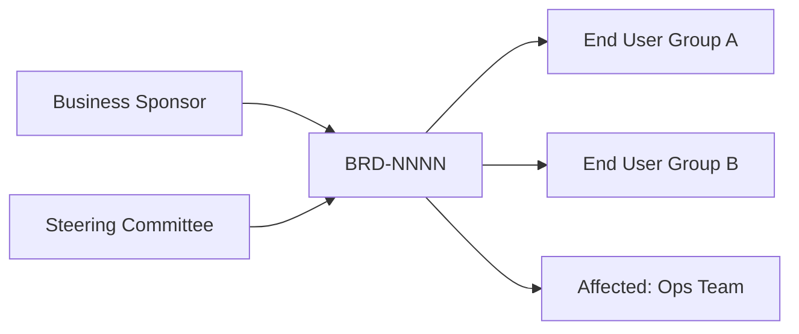
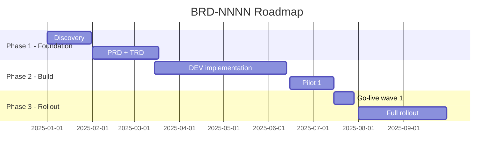

# BRD-{{NNNN}}: {{Title}}

> **FIS analog:** Business Requirements Document — high-level business view, **trước PRD**.
> Output của BA — phục vụ stakeholder external (sponsor, board, vendor RFP).
> **Khác PRD:** BRD focus business case + ROI; PRD focus product detail. Một số dự án dùng BRD thay PRD ở phase concept.

## Bảng ghi nhận thay đổi tài liệu

| Phiên bản | Ngày | Người sửa | Mô tả thay đổi |
|---|---|---|---|
| 1.0 |  |  | Initial draft |

## Trang ký

| Vai trò | Họ và tên | Chữ ký | Ngày |
|---|---|---|---|
| BA Author |  |  |  |
| Business Sponsor |  |  |  |
| Stakeholder Lead |  |  |  |
| Legal/Compliance |  |  |  |

---

## I. Executive summary

### 1.1. Vấn đề kinh doanh
{1-2 đoạn — pain point cụ thể, có data nếu có}

### 1.2. Đề xuất giải pháp (high-level)
{1 đoạn — không dive vào tech, chỉ business outcome}

### 1.3. Kết quả mong đợi
| Metric | Baseline | Target | Period |
|---|---|---|---|
| {KPI 1} | {current} | {target} | {3M / 6M / 1Y} |
| {KPI 2} | ... | ... | ... |

### 1.4. Investment & ROI
| Item | Chi phí | Lợi nhuận dự kiến | Payback period |
|---|---|---|---|
| Development | {VND/USD} | - | - |
| Infrastructure | {monthly} | - | - |
| Operations | {monthly} | {monthly saving} | {months} |
| **Total** | {Total} | {Total} | **{Months}** |

## II. Business context

### 2.1. Strategic alignment
{Liên kết với mục tiêu chiến lược công ty}

### 2.2. Stakeholder map

### 2.3. Stakeholder details
| Stakeholder | Role | Interest | Influence | Engagement strategy |
|---|---|---|---|---|
| {Tên} | Sponsor | High | High | Weekly sync |
| {Tên} | End user A | High | Low | Monthly demo |
| {Tên} | Ops affected | Medium | Medium | Change mgmt training |

### 2.4. Current state (As-Is)
{Mô tả tình trạng hiện tại — pain point, manual process, gap}

### 2.5. Future state (To-Be)

## III. Business requirements (high-level)

### 3.1. Functional needs (business level)
- BR-01: {Need} — Priority: Must
- BR-02: {Need} — Priority: Should
- BR-03: {Need} — Priority: Could
- BR-04: {Need} — Priority: Won't (this release)

### 3.2. Compliance & regulatory
| Requirement | Source | Deadline | Penalty if missed |
|---|---|---|---|
| GDPR data export | EU regulation | Already in force | Fine up to 4% revenue |
| Vietnamese banking law (SBV) | Decree 13/2023 | 2025-Q4 | License risk |
| Internal policy IT-SEC-01 | Internal | Continuous | Audit finding |

### 3.3. Constraints
- **Timeline:** Go-live by {date} (driven by {regulation/contract/event})
- **Budget:** Cap {VND/USD}
- **Resource:** {team size}
- **Tech stack:** Must integrate với hệ thống hiện có ({list})

## IV. Solution options (analysed)

### 4.1. Option 1 — {Name}
**Description:** {1 đoạn}
**Pros:** ...
**Cons:** ...
**Cost:** ...
**Time:** ...
**Risk:** ...

### 4.2. Option 2 — {Name}
{Same structure}

### 4.3. Option 3 — Do nothing (status quo)
**Pros:** Zero investment
**Cons:** Pain point continues; competitive risk; compliance gap

### 4.4. Recommended option
**Choice:** Option {N}
**Justification:** {Why this option}

## V. Implementation roadmap (business milestones)

| Milestone | Target date | Owner | Success criteria |
|---|---|---|---|
| PRD Approved | {date} | BA | 3-Amigos signoff |
| Pilot 1 live | {date} | DEV+Ops | 100 users, 95% adoption |
| Full rollout | {date} | All | 100% migration done |

## VI. Risk & dependency

### 6.1. Top risks
| Risk | Likelihood | Impact | Mitigation | Owner |
|---|---|---|---|---|
| Vendor delay on integration API | M | H | Buffer 2 weeks; alt vendor screening | PM |
| User adoption resistance | M | M | Change mgmt + training | Business owner |
| Budget overrun | L | H | Bi-weekly cost review | PM |

### 6.2. External dependencies
- Vendor X delivers API by {date}
- Internal team Y completes prerequisite project by {date}
- Legal sign-off on data sharing agreement by {date}

## VII. Success criteria & KPIs

### 7.1. Quantitative
| KPI | Baseline | 3M target | 6M target | 12M target |
|---|---|---|---|---|
| {Metric} | {now} | {3m} | {6m} | {12m} |

### 7.2. Qualitative
- User satisfaction NPS ≥ +20
- Compliance audit pass rate 100%
- Zero P0 incident in first 30 days

## VIII. Approvals required

| Stakeholder | Sign-off needed | Date |
|---|---|---|
| Business Sponsor | Yes | TBD |
| CFO (budget) | Yes (if > {threshold}) | TBD |
| Legal | Yes | TBD |
| IT Security | Yes | TBD |
| Compliance | Yes (regulatory items) | TBD |

## IX. Next steps

After BRD Approved:
1. BA → `/fis:ba create` → PRD-NNNN (chi tiết product spec)
2. BA + SA → SOD per quy trình via `/fis:ba sod`
3. BA + SA → DDD/DBDD via `/fis:ba ddd-business` + `/fis:ba ddd-business`
4. SA → TRD design via `/fis:plan`

## X. Out-of-scope (explicit at business level)

- {Item} → defer to BRD-NNNN-v2 / next initiative
- {Item} → handled by separate program

## XI. Glossary

| Term | Definition |
|---|---|
| {Term} | {Vietnamese definition} |

---

*Auto-generated từ `claude/skills/fis-ba/references/templates/brd.template.md`. Export docx qua `/fis:docs export BRD-NNNN`.*
