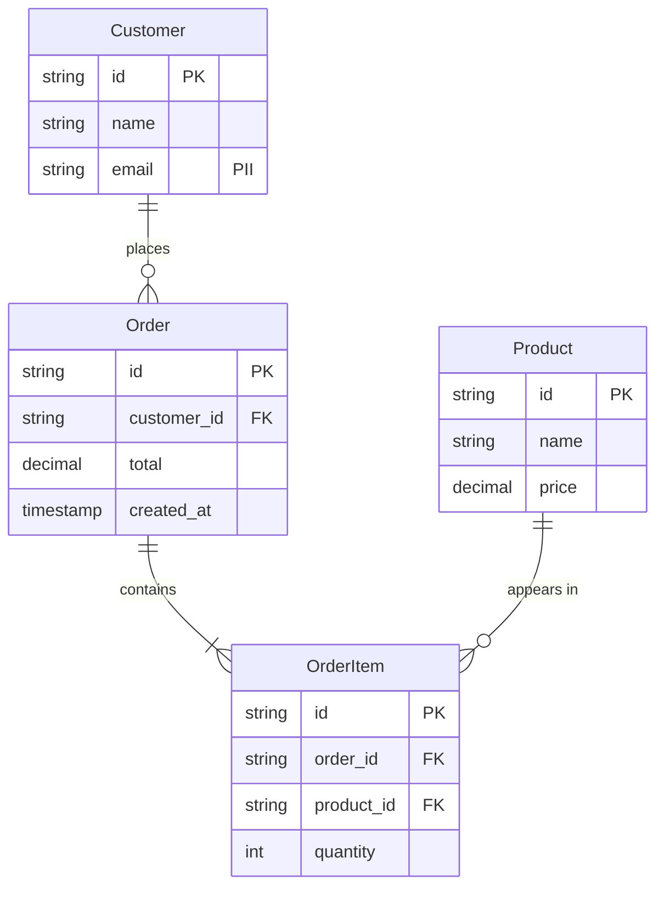

# DBDD-{{NNNN}}: {{Title}}

> **FIS analog:** Database Design Document — schema, entity, relationship, constraints.
> Output collaborative: BA viết §I-III (business view), SA append §IV-VI (tech binding) qua `/fis:ba ddd-business`.

## Bảng ghi nhận thay đổi tài liệu

| Phiên bản | Ngày | Người sửa | Mô tả thay đổi | CR ID |
|---|---|---|---|---|
| 1.0 |  |  | Initial draft (BA §I-III) | - |

## Trang ký

| Vai trò | Họ và tên | Chữ ký | Ngày |
|---|---|---|---|
| BA Author |  |  |  |
| SA Reviewer & §IV-VI Author |  |  |  |
| DBA Reviewer |  |  |  |

---

## I. Business context (BA-owned)

### 1.1. Phạm vi data
{Module/feature scope, link tới PRD/FSD parent}

### 1.2. Stakeholder data needs
| Stakeholder | Data cần | Use case | Compliance |
|---|---|---|---|
| {Role} | {Field} | {Why} | {GDPR/PII/audit?} |

### 1.3. Data classification
| Tier | Definition | Examples | Handling |
|---|---|---|---|
| Public | Không nhạy cảm | Product catalog | No special |
| Internal | Business-only | Inventory | Encrypt at rest |
| Confidential | PII / financial | Customer name, SSN | Encrypt + audit log |
| Restricted | Compliance-critical | Payment card, password | HSM, no-export |

## II. Logical data model (BA view)

### 2.1. Entity overview


### 2.2. Entity dictionary (BA-perspective)

#### Customer
- **Description:** Người mua
- **Business rules:** 1 email duy nhất; phone số VN format `+84...`
- **Lifecycle:** Created on signup; soft-delete (status=inactive) khi unsubscribe; hard-delete sau 7 năm theo GDPR
- **PII fields:** email, phone, address (encrypted at rest)

#### Order
- **Description:** Đơn hàng
- **Business rules:** Total = sum(OrderItem.quantity * Product.price); immutable sau status=Paid
- **Lifecycle:** Created → Pending → Paid → Shipped → Delivered (or Cancelled at any step)

#### OrderItem
- **Description:** Dòng item trong đơn
- **Business rules:** quantity >= 1; product.deleted=true thì không add mới
- **Constraint:** unique(order_id, product_id) — không duplicate

### 2.3. Relationships rules (business)
| Rel | Rule |
|---|---|
| Customer → Order | 1 customer có N order; cascade soft-delete |
| Order → OrderItem | 1 order có ≥1 OrderItem; cascade hard-delete khi order cancelled |
| Product → OrderItem | Product.deleted=true vẫn giữ OrderItem (audit trail); UI hiển thị "Deleted product" |

## III. Data validation & constraints (business view)

### 3.1. Field-level
| Entity.Field | Validation | Error message (vi) |
|---|---|---|
| Customer.email | regex email + unique | "Email đã tồn tại" |
| Customer.phone | VN format `+84 (3\|5\|7\|8\|9)x...` | "Số điện thoại không hợp lệ" |
| Order.total | >= 0; precision 2 | "Tổng tiền không hợp lệ" |
| Product.price | > 0; HALF_EVEN rounding | "Giá phải lớn hơn 0" |

### 3.2. Cross-field rules
| Rule | Apply on | Action |
|---|---|---|
| Order.total = sum(items) | Update | Recompute auto |
| Customer.deleted_at must be null OR future | Update | Reject |

### 3.3. Compliance & audit
- **PII fields:** Customer.{email, phone, address}
- **Audit fields required:** created_at, updated_at, deleted_at, created_by, updated_by
- **Retention policy:** Hard-delete sau 7 năm (GDPR); soft-delete kept 30 ngày trước hard
- **Export rules:** PII data export chỉ cho admin role + audit log

## IV. Physical schema (SA-owned, append qua /fis:ba ddd-business)

> *Section này điền bởi SA, KHÔNG phải BA. BA chỉ approve sau SA append.*

### 4.1. DDL (placeholder)
```sql
-- TBD by SA
```

### 4.2. Indexes (placeholder)
TBD by SA: PK, FK, unique, composite, partial.

### 4.3. Partitioning / sharding (placeholder)
TBD by SA.

## V. Migration strategy (SA-owned)

### 5.1. Schema migration plan (placeholder)
TBD by SA: tool (Liquibase/Flyway/Prisma), order, rollback.

### 5.2. Data migration (brownfield only, placeholder)
TBD by SA.

## VI. Performance & scaling (SA-owned)

### 6.1. Expected volume (placeholder)
TBD by SA: rows/day, queries/s, growth rate.

### 6.2. Hot paths & indexing strategy (placeholder)
TBD by SA.

---

## VII. Out-of-scope (BA + SA agree)

- {Item 1} → defer to DBDD-NNNN
- {Item 2} → not in current release

## VIII. Risks & assumptions

| Risk | Likelihood | Impact | Mitigation |
|---|---|---|---|
| Schema rigidity blocks feature CRs | M | M | Use JSON column for flexible attrs (SA decision) |
| PII data leak via export | L | H | Mask + audit log + role check |

| Assumption | Validation |
|---|---|
| Customer base < 10M trong 3 năm | Check growth metric quarterly |

---

*Auto-generated từ `claude/skills/fis-ba/references/templates/dbdd.template.md`. SA append §IV-VI qua `/fis:ba ddd-business --ddd DBDD-NNNN`.*
