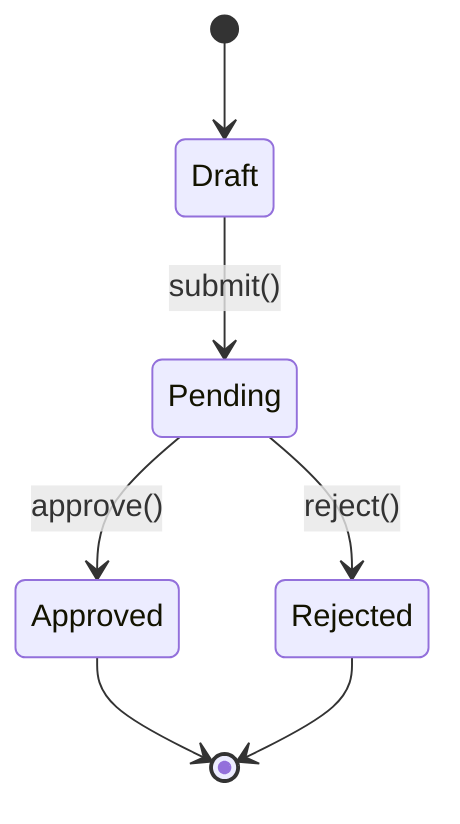

# DDD-{{NNNN}}: {{Tên màn hình}}

> **FIS analog:** DDD (Detailed Design Document / Tài liệu Thiết kế Chi tiết Chức năng).
> Collaborative — BA fills §I-IV (business behavior + screen intent), SA appends §V-VIII (data binding + tech validation).

## Bảng ghi nhận thay đổi tài liệu

| Ngày thay đổi | Vị trí thay đổi | Lý do | Phiên bản cũ | Mô tả thay đổi | Phiên bản mới |
|---|---|---|---|---|---|
|  |  | Tạo mới |  | BA initial draft | v0.1 |
|  | §V-VIII | SA append | v0.1 | SA technical detail | v0.2 |

## Trang ký

> Manual fill sau review.

| Đơn vị | Họ và tên | Chức vụ | Chữ ký |
|---|---|---|---|
|  |  | BA Author (§I-IV) |  |
|  |  | SA Author (§V-VIII) |  |
|  |  | DEV Lead Reviewer |  |
|  |  | QA Reviewer |  |

---

# PHẦN 1 — BA (§I-IV: Business Behavior + Screen Intent)

## I. TỔNG QUAN

### I.1. Mục đích

> 1-2 câu mô tả mục đích screen.

-

### I.2. Phạm vi (Story reference)

> Story parent: US-{{NNNN}}. Phân hệ nào, bound context nào.

-

### I.3. Persona

> Persona primary + secondary (link `personas/PERSONAS.md`).

| Persona | Role | Frequency | Note |
|---|---|---|---|
| Primary |  |  |  |
| Secondary |  |  |  |

### I.4. Thuật ngữ

| Thuật ngữ | Định nghĩa |
|---|---|
|  |  |

### I.5. Tham chiếu yêu cầu

| Mã | Tên tài liệu | Section |
|---|---|---|
| PRD-{{NNNN}} |  |  |
| TRD-{{NNNN}} |  |  |
| US-{{NNNN}} |  |  |

---

## II. SCREEN INTENT + MOCKUP

### II.1. Screen task

> User làm gì trên screen này?

-

### II.2. Pre-condition

> Khi nào user có thể vào screen này?

-

### II.3. Success criteria

> Khi nào user "xong" task?

-

### II.4. Mockup

> Wireframe artifact (HTML default — Tailwind + shadcn/ui via Claude artifact).

[WF-{{NNNN}}.html](../../wireframes/WF-{{NNNN}}.html) | ASCII fallback below:

```
+----------------------------------------+
| {{Header / breadcrumb}}                |
+----------------------------------------+
| {{Form / list / detail content}}       |
+----------------------------------------+
| {{Footer actions}}                     |
+----------------------------------------+
```

---

## III. USER ACTIONS

| Hành động | Trigger | Pre-condition | Effect (business) | Permission |
|---|---|---|---|---|
| Submit | Click button "Lưu" | Form valid | Tạo record + notify Manager | Role: Customer |
| Cancel | Click "Hủy" | (always) | Discard form, back to list | (any) |
|  |  |  |  |  |

---

## IV. BUSINESS VALIDATION RULES

### IV.1. Field-level rules

| Field | Rule | Error message (Vietnamese) |
|---|---|---|
| Số tiền | > 0 | "Số tiền phải lớn hơn 0" |
| Nội dung | Không trống | "Vui lòng nhập nội dung" |
|  |  |  |

### IV.2. Cross-field rules

| Rule | Logic | Error message |
|---|---|---|
|  |  |  |

### IV.3. Edge cases (business)

- [ ] Empty state: data trống thì hiển thị gì?
- [ ] Error state: external system fail?
- [ ] Permission denied: user không quyền?
- [ ] Data conflict: 2 user cùng edit?
- [ ] Cancel mid-flow: F5 / close browser?

---

# PHẦN 2 — SA (§V-VIII: Data Binding + Tech Validation)

> Append qua `/fis:ba ddd-business --ddd=DDD-{{NNNN}}` sau khi BA hoàn thành §I-IV.

## V. FIELD TABLE (types/constraints)

| STT | Trường | Type | Required | Validation tech | DB column | Default | Notes |
|---|---|---|---|---|---|---|---|
| 1 |  |  |  |  |  |  |  |
| 2 |  |  |  |  |  |  |  |

---

## VI. DATA BINDING (UI ↔ Model)

| Field UI | Data model field | Direction | Transform |
|---|---|---|---|
| `txnAmount` | `Transaction.amount` | write | parseFloat |
|  |  |  |  |

---

## VII. STATE MACHINE + TECH VALIDATION

### VII.1. State machine



### VII.2. Tech validation regex / format

| Field | Pattern | Note |
|---|---|---|
| email | `/^[\w.+-]+@[\w-]+\.[\w.-]+$/` | RFC 5321 simplified |
| phone VN | `/^\+84[3578]\d{8}$/` | Mobile prefixes |
|  |  |  |

---

## VIII. API ENDPOINT REFS

| Action | HTTP | Endpoint | Request | Response | Auth | TRD ref |
|---|---|---|---|---|---|---|
| Submit | POST | /api/transfers | `{from, to, amount}` | `{txnId, status}` | Bearer JWT | TRD-NNNN §V.1 |
|  |  |  |  |  |  |  |
