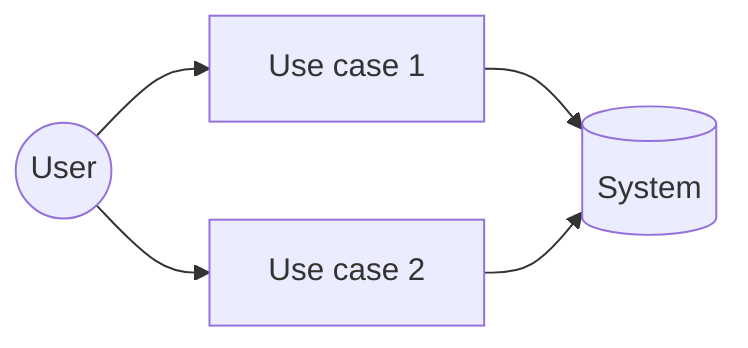
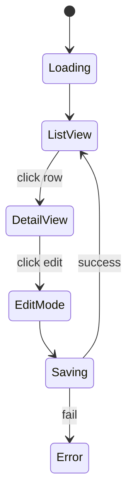
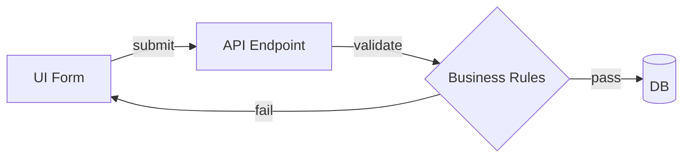

# FSD-{{NNNN}}: {{Title}}

> **FIS analog:** Functional Specification Document — chi tiết functional cho 1 module/feature cụ thể (zoom in từ PRD).
> Output của BA collaborate với SA — input cho DEV implement + QA test design.
> **Khác PRD:** FSD focused 1 module thay vì whole product.

## Bảng ghi nhận thay đổi tài liệu

| Phiên bản | Ngày | Người sửa | Mô tả thay đổi | CR ID |
|---|---|---|---|---|
| 1.0 |  |  | Initial draft | - |

## Trang ký

| Vai trò | Họ và tên | Chữ ký | Ngày |
|---|---|---|---|
| BA Author |  |  |  |
| SA Reviewer |  |  |  |
| QA Reviewer |  |  |  |
| Stakeholder |  |  |  |

## I. Tổng quan module

### 1.1. Phạm vi
- **In-scope:** {liệt kê functional in-scope cụ thể}
- **Out-of-scope:** {liệt kê features không thuộc FSD này — link sang FSD khác nếu cần}

### 1.2. Mục tiêu
{Outcome-driven, không activity. Quantify khi có thể.}

### 1.3. Stakeholder & user
| Persona | Role | Cần gì từ module này |
|---|---|---|
| {Tên} | {Role} | {Need} |

### 1.4. Tham chiếu
- PRD parent: PRD-NNNN
- Related FSD: FSD-NNNN (nếu có)
- Related DDD/BRD: ...

## II. Functional Requirements (chi tiết)

### 2.1. Use case overview

### 2.2. Use cases chi tiết

#### UC-01: {Tên use case}

**Actor:** {primary actor}
**Trigger:** {sự kiện kích hoạt}
**Pre-condition:** {state trước UC}
**Post-condition (success):** {state sau UC khi thành công}
**Post-condition (failure):** {state sau UC khi thất bại}

**Main flow:**
1. {Step 1}
2. {Step 2}
3. ...

**Alternative flow A (variant scenario):**
- A1. {Step}
- A2. {Step}

**Exception flow E (error scenario):**
- E1. {Step}

**Business rules áp dụng:** BR-01, BR-03

#### UC-02: {Tên}
{Same structure}

### 2.3. Business rules

| Rule ID | Description | Trigger | Action | Source |
|---|---|---|---|---|
| BR-01 | {Rule} | {When} | {Then} | {Document/Stakeholder} |

### 2.4. Validation rules

| Field | Validation | Error message |
|---|---|---|
| {field} | {regex/range/required} | {Vietnamese message} |

## III. UI/UX requirements

### 3.1. Wireframe / mockup
{Embed link tới `/fis:wireframe html` output, hoặc paste ASCII fallback}

### 3.2. Interaction flow

### 3.3. Accessibility & i18n
- WCAG: {AA / AAA target}
- Locale support: {vi, en, ...}

## IV. Data requirements (overview)

> **Note:** Chi tiết schema trong DBDD-NNNN. Đây là functional view.

### 4.1. Entities involved
| Entity | Source | CRUD operations | Notes |
|---|---|---|---|
| User | Auth service | Read | |
| Order | Local DB | CRUD | |

### 4.2. Data flow

### 4.3. Data lifecycle
- Created: {khi nào}
- Updated: {khi nào, by who}
- Archived: {chính sách giữ data}
- Deleted: {soft/hard delete}

## V. Integration & dependencies

### 5.1. External APIs
| API | Purpose | Auth | SLA |
|---|---|---|---|
| {Service} | {Why} | {OAuth/API key} | {99.9%} |

### 5.2. Internal services
{Liệt kê các module/service khác mà module này gọi/được gọi}

## VI. Non-functional requirements

| NFR | Target | Measurement |
|---|---|---|
| Performance — list view load | < 2s p95 | Lighthouse / k6 |
| Concurrency | 50 user/s sustained | Load test |
| Availability | 99.5% / month | Uptime monitoring |
| Security — input validation | 100% sanitized | OWASP scan |
| Audit trail | All write ops logged | Log retention 90d |

## VII. Edge cases & error handling

| Scenario | Expected behavior | Recovery |
|---|---|---|
| Network timeout | Show retry button | User retry, max 3x |
| Concurrent edit | Optimistic lock + last-write-wins warning | UI confirm |
| Duplicate submit | Idempotency key | Server reject duplicate |

## VIII. Out-of-scope (explicit)

- {Item 1} → defer to FSD-NNNN (next version)
- {Item 2} → not in roadmap

## IX. Acceptance criteria (high-level)

> **Note:** AC chi tiết Given/When/Then thuộc về Story (SA decompose). Đây là FSD-level AC roll-up.

- AC-01: {Outcome 1 — testable}
- AC-02: {Outcome 2}

## X. Risk & assumptions

| Risk | Likelihood | Impact | Mitigation |
|---|---|---|---|
| {Risk} | {L/M/H} | {L/M/H} | {Action} |

| Assumption | Validation needed |
|---|---|
| {Assumption} | {How to verify} |

---

*Auto-generated từ `claude/skills/fis-ba/references/templates/fsd.template.md`. Render docx qua `/fis:docs export FSD-NNNN`.*
