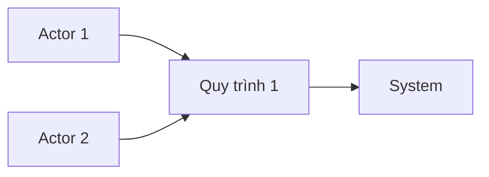
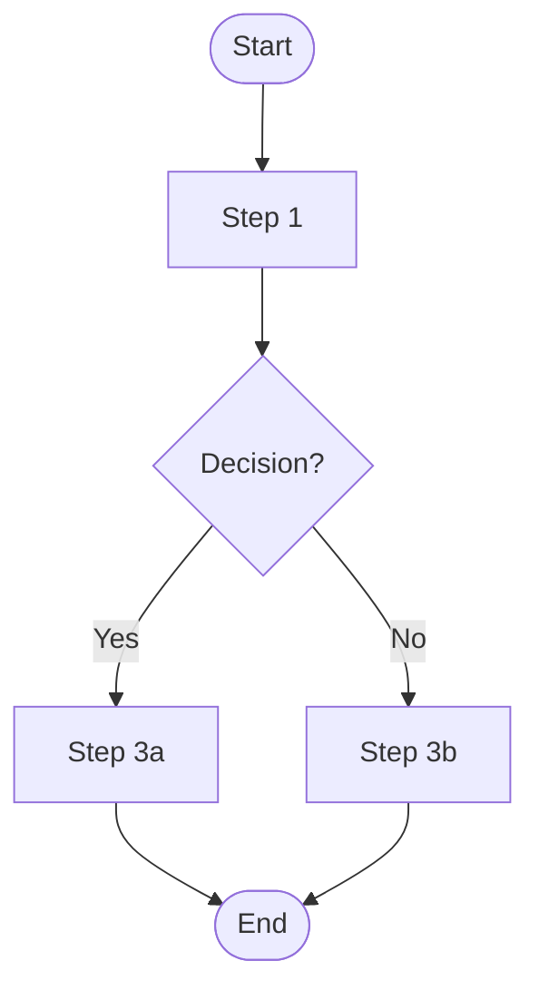

# PRD-{{NNNN}}: {{Title}}

> **FIS analog:** SOD (Statement of Detail / Tài liệu Phân tích Luồng Nghiệp Vụ).
> Output của BA — input bắt buộc của SA.

## Bảng ghi nhận thay đổi tài liệu

| Phiên bản | Ngày | Người sửa | Mô tả thay đổi | CR ID |
|---|---|---|---|---|
| 1.0 |  |  | Initial draft | - |

## Trang ký

| Vai trò | Họ và tên | Chữ ký | Ngày |
|---|---|---|---|
| BA Author |  |  |  |
| SA Reviewer |  |  |  |
| QA Reviewer |  |  |  |
| PO/Sponsor |  |  |  |

---

## I. Tổng quan

### 1.1 Mục đích

> Mô tả mục tiêu của tài liệu, ai dùng, dùng để làm gì.

-

### 1.2 Phạm vi

> Tài liệu áp dụng cho hệ thống/phân hệ/feature nào.

-

### 1.3 Thuật ngữ và từ viết tắt

| Thuật ngữ | Định nghĩa |
|---|---|
|  |  |

### 1.4 Tài liệu tham chiếu

| Mã | Tên tài liệu | Phiên bản |
|---|---|---|
|  |  |  |

---

## II. Vấn đề và mục tiêu

### 2.1 Problem statement

**Vấn đề hiện tại:**
-

**Tại sao cần giải quyết bây giờ:**
-

**Ai bị ảnh hưởng:**
-

### 2.2 Goals

1.
2.

### 2.3 Non-Goals (cố ý không làm)

1.
2.

### 2.4 Success metrics (KPI)

| KPI | Baseline hiện tại | Target | Đo bằng |
|---|---|---|---|
|  |  |  |  |

---

## III. Danh sách yêu cầu

### 3.1 Yêu cầu trong phạm vi hợp đồng

| ID | Yêu cầu | Loại | Ưu tiên | Ghi chú |
|---|---|---|---|---|
| FR-1 |  | Functional | Must |  |
| NFR-1 |  | Non-Functional | Should |  |

### 3.2 Yêu cầu ngoài phạm vi hợp đồng

| ID | Yêu cầu | Lý do out-of-scope |
|---|---|---|
|  |  |  |

### 3.3 Non-Functional Requirements

| NFR | Target | Đo bằng |
|---|---|---|
| Performance |  |  |
| Security |  |  |
| Accessibility |  |  |
| Scalability |  |  |
| Compatibility |  |  |

---

## IV. Đối tượng sử dụng hệ thống

> Reference: `artifacts/personas/PERSONAS.md`

### 4.1 Định nghĩa đối tượng

| Vai trò | Mô tả | Số lượng dự kiến | Tần suất sử dụng |
|---|---|---|---|
|  |  |  |  |

### 4.2 Tổng quan quy trình và đối tượng tham gia

---

## V. Quy trình nghiệp vụ

> Mỗi quy trình là 1 sub-section. Theo cấu trúc FIS SOD: Yêu cầu → Trigger → Next event → Sơ đồ luồng nghiệp vụ (process flow) → Step description.

### 5.1 Quy trình [Tên quy trình 1]

#### 5.1.1 Yêu cầu

**Mục đích:**
-

**Yêu cầu chung:**
-

#### 5.1.2 Sự kiện kích hoạt quy trình

> Khi nào quy trình này bắt đầu? Trigger nào (user action / scheduled / system event)?

-

#### 5.1.3 Sự kiện tiếp theo khi kết thúc quy trình

> Sau khi quy trình kết thúc, hệ thống làm gì tiếp? Notify ai? Ghi log gì?

-

#### 5.1.4 Sơ đồ luồng nghiệp vụ

> Mermaid flowchart cho draft. Khi cần BPMN 2.0 chuẩn (pool/lane, event types, gateway XOR/AND/OR), escalate qua Figma `generate_diagram` MCP hoặc bpmn-js artifact — invoke `/fis:docs` skill (xem `references/diagram-pipeline.md` trong skill đó).

#### 5.1.5 Mô tả các bước trong quy trình

| STT | Bước | Actor | Mô tả | Đầu vào | Đầu ra | Validation |
|---|---|---|---|---|---|---|
| 1 |  |  |  |  |  |  |
| 2 |  |  |  |  |  |  |

### 5.2 Quy trình [Tên quy trình 2]

> Lặp cấu trúc 5.1.1 - 5.1.5 cho từng quy trình.

---

## VI. User stories (high-level)

> Chi tiết Story do SA viết ở `artifacts/stories/US-NNNN.md`. Đây là draft cấp PRD.

- Là một **[persona]**, tôi muốn **[action]** để **[value]**.
-

---

## VII. Constraints, assumptions, dependencies

### 7.1 Constraints
- Budget / timeline / tech stack giới hạn
-

### 7.2 Assumptions
- Giả định về user behavior, infra, vendor
-

### 7.3 Out-of-scope dependencies
> Module/feature/team khác mà PRD này phụ thuộc.
-

---

## VIII. Risks

| Risk | Likelihood | Impact | Mitigation | Owner |
|---|---|---|---|---|
|  | L/M/H | L/M/H |  |  |

---

## IX. Open questions

> Câu hỏi chưa giải quyết — cần Three Amigos clarify.

-

---

## X. Phụ lục

- Reference docs / mockups / research / regulatory
-

---

## Three Amigos review summary

> Auto-populated khi `/fis:three-amigos review-prd PRD-{{NNNN}}` chạy.
> Chi tiết tại `reviews/RV-NNNN.md`.

| Role | Verdict | Date | Note |
|---|---|---|---|
| BA |  |  |  |
| SA |  |  |  |
| QA |  |  |  |
