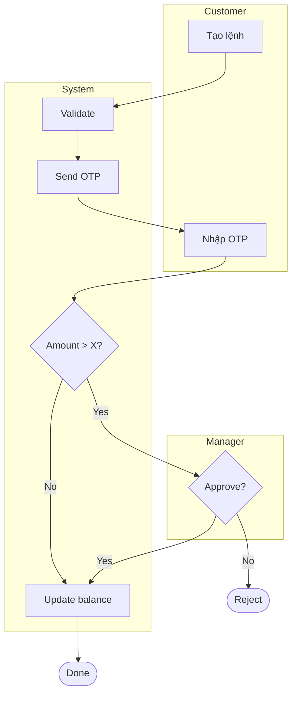

# SOD-{{NNNN}}: {{Tên quy trình}}

> **FIS analog:** SOD (Statement of Detail / Tài liệu Phân tích Luồng Nghiệp Vụ).
> 1 SOD = 1 quy trình. Tham chiếu PRD §V.X parent.

## Bảng ghi nhận thay đổi tài liệu

| Ngày thay đổi | Vị trí thay đổi | Lý do | Phiên bản cũ | Mô tả thay đổi | Phiên bản mới |
|---|---|---|---|---|---|
|  |  | Tạo mới |  | Initial draft | v0.1 |

## Trang ký

> Manual fill sau review.

| Đơn vị | Họ và tên | Chức vụ | Chữ ký |
|---|---|---|---|
|  |  | BA Author |  |
|  |  | SA Reviewer |  |
|  |  | QA Reviewer |  |
|  |  | PO/Sponsor |  |

---

## I. TỔNG QUAN

### 1.1. Mục đích

> 1-2 câu mô tả mục tiêu của quy trình.

-

### 1.2. Phạm vi

> Phân hệ / module / persona nào tham gia.

-

### 1.3. Thuật ngữ và từ viết tắt

| Thuật ngữ | Định nghĩa |
|---|---|
|  |  |

### 1.4. Tài liệu tham chiếu

| Mã | Tên tài liệu | Phiên bản |
|---|---|---|
| PRD-{{NNNN}} | Parent PRD |  |

---

## II. YÊU CẦU

**Mục đích quy trình:**
-

**Yêu cầu chung:**
-

---

## III. SỰ KIỆN KÍCH HOẠT QUY TRÌNH

> Trigger: User action / Scheduled / System event / External webhook.

-

---

## IV. SỰ KIỆN TIẾP THEO KHI KẾT THÚC QUY TRÌNH

> Notify ai? Cascade event nào? Audit log gì?

-

---

## V. SƠ ĐỒ LUỒNG NGHIỆP VỤ

> Mermaid swimlane (BA owns). Khi cần BPMN 2.0 chuẩn → invoke `/fis:docs` (Tier 2 Figma MCP / Tier 3 bpmn-js).

---

## VI. MÔ TẢ CÁC BƯỚC TRONG QUY TRÌNH

| STT | Bước | Actor | Mô tả | Đầu vào | Đầu ra | Validation |
|---|---|---|---|---|---|---|
| 1 |  |  |  |  |  |  |
| 2 |  |  |  |  |  |  |
| 3 |  |  |  |  |  |  |
| 4 |  |  |  |  |  |  |
| 5 |  |  |  |  |  |  |

---

## VII. RISKS

| Risk | Likelihood | Impact | Mitigation | Owner |
|---|---|---|---|---|
|  | L/M/H | L/M/H |  |  |

---

## VIII. PHỤ LỤC

- Reference docs / regulation (SBV / EVN / NDC etc.)
- Mockup / wireframe link (nếu có UI screen liên quan → DDD-NNNN)
- Sample data / test scenario
-
