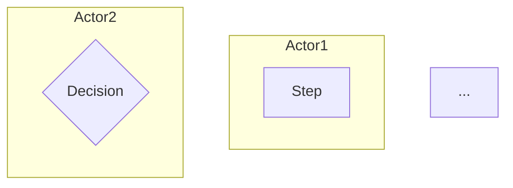

# Mode: sod — Statement of Detail (process flow)

## Trigger
"Viết SOD cho [quy trình]" / "Process flow" / "Tách quy trình từ PRD-XXXX" / "Mỗi quy trình 1 SOD"

## Khi dùng

- PRD §V (Quy trình nghiệp vụ) cần tách thành SOD riêng cho mỗi quy trình
- Quy trình mới phát sinh (ngoài PRD scope ban đầu)
- Stakeholder cần document riêng quy trình cụ thể (vd "Quy trình duyệt khoản vay", "Quy trình hủy thuê bao")

## Pre-step (recommended)

Nếu chưa rõ event flow → chạy `/fis:elicit event-storm` trước → output làm input cho `--from-elicit=EL-NNNN`.

## Steps

### 1. Resolve input

| Input | Source |
|---|---|
| `--from=PRD-NNNN` | Read PRD §V — extract 1 quy trình → SOD |
| `--from-elicit=EL-NNNN` | Read Event Storm canvas → render SOD |
| `--name=<slug>` (freeform) | User mô tả quy trình bằng AskUserQuestion |

### 2. Auto-assign SOD ID

Count `artifacts/sod/SOD-*.md` → next NNNN.

### 3. Gather input qua AskUserQuestion (batched)

**Batch 1 — Tổng quan:**
- Tên quy trình (Vietnamese, vd "Quy trình duyệt giao dịch lớn")
- Mục đích (1-2 câu)
- Phạm vi (phân hệ nào, persona nào tham gia)

**Batch 2 — Trigger + cascade:**
- Sự kiện kích hoạt (User action / Scheduled / System event)
- Sự kiện tiếp theo sau khi xong (Notify ai? Cascade event nào?)

**Batch 3 — Steps:**
- Liệt kê 5-15 bước (Actor + Action + Input + Output + Validation)
- Decision points (gateway XOR/AND)
- Error/exception flow

**Batch 4 — Risk + reference:**
- Risks chính (likelihood × impact + mitigation)
- Reference docs / regulation (vd SBV, EVN regulation)

### 4. Generate Mermaid swimlane diagram




### 5. Fill SOD template

Use `references/templates/sod.template.md` — fill 8 section:
- I. TỔNG QUAN (Mục đích / Phạm vi / Thuật ngữ / Tham chiếu)
- II. YÊU CẦU (Mục đích quy trình / Yêu cầu chung)
- III. SỰ KIỆN KÍCH HOẠT
- IV. SỰ KIỆN TIẾP THEO
- V. SƠ ĐỒ LUỒNG NGHIỆP VỤ (Mermaid swimlane)
- VI. MÔ TẢ CÁC BƯỚC (step table)
- VII. RISKS
- VIII. PHỤ LỤC

### 6. Save

Output: `artifacts/sod/SOD-NNNN-<slug>.md` với frontmatter:

```yaml
---
id: SOD-NNNN
type: sod
title: "Quy trình ..."
parents: [PRD-NNNN]
parent_section: "§V.X"
version: 1
project_code: ""
document_code: ""
---
```

### 7. Optional escalate diagram

AskUserQuestion: "Cần render BPMN 2.0 chuẩn cho stakeholder review không?"
- Yes → invoke `/fis:docs` → diagram-pipeline.md Tier 2 (Figma MCP) hoặc Tier 3 (bpmn-js)
- No → giữ Mermaid Tier 1

## Convergence check

- ≥ 5 steps trong VI table
- ≥ 1 decision point
- ≥ 1 error/exception flow
- Diagram render OK (Mermaid syntax valid)

## Reference

- `references/templates/sod.template.md`
- `references/fis-doc-writing-style.md` — Vietnamese formal tone
